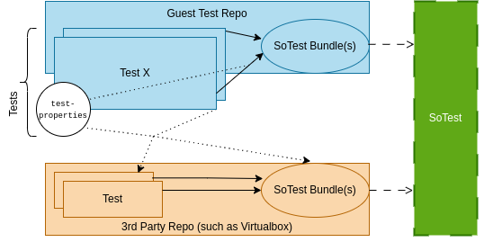

# Reuse Guest Tests (with Nix)

## About

This document discusses how guest tests can be reused using Nix so that 3rd
party projects, such as Virtualbox and other VMMs, can create test runs based on
the guest tests.

**TL;DR:**
Test runs can be created based on the test binary artifacts
(`tests.<testname>.<elf32|elf64|iso|efi>`). These test runs may be adjusted
using the corresponding test metadata
(`tests.<testname>.<elf32|elf64|iso|efi>.meta`). Whereas the guest test
repository provides (internal!) functionality to execute tests directly on the
hardware, a VMM project might run a Linux-based system that starts the VMM that
runs a guest test.

Although SoTest is called as a specific example to submit test runs to, this
guide is not tied to SoTest at all and only uses it as example.

## Terminology

This document heavily focuses on Nix. So, if we speak about SoTest bundles and
binary variants, we are usually referring to Nix attributes that evaluate to
corresponding derivations. _Tests_ is just a shorthand for the guest tests.
A _boot item_ is a guest test packaged in a way that it can be booted and run
on a (virtual) platform. A _test run_ is the execution of one or multiple boot
items.

## Motivation

3rd party projects, specifically virtualization projects, might want to use the
tests to verify that their virtualization stacks behave as they should. Such a
test run might start the VMM that is configured to boot guest test X.

## Binary Variants, Metadata, and Attribute Overriding

Each test exports multiple binary variants with associated metadata
(`tests.<name>.{elf32|elf64|iso|efi}`). Please find more details in the
[README.md](/README.md).

## Creating Test Runs

Depending on the environment where runs are effectively executed, i.e., bare
metal or a virtual platform, consumers can use the exported binary variants of
each test to create matching boot items. For legacy BIOS boot, the `iso` boot
variant may be used whereas for UEFI systems the `efi` boot variant might be the
right option. Further, the `elf32` and `elf64` variants can also be used to
create more customized boot items that boot a test according to the capabilities
described in the [README.md](/README.md).
<!-- TODO: Make iso legacy + uefi bootable. Follow-up. -->

The figure down below summarizes all relevant parts in context with SoTest as
example. The tests are used to create SoTest bundle(s) for test execution.

